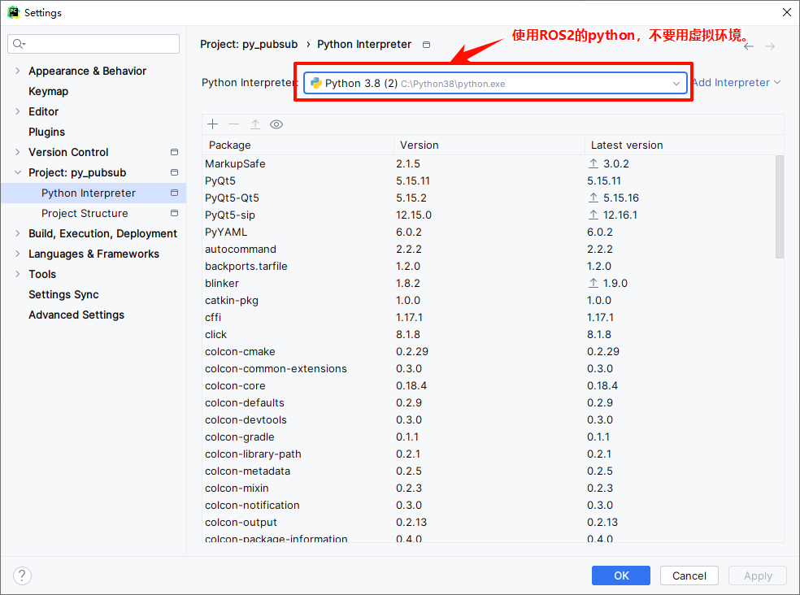
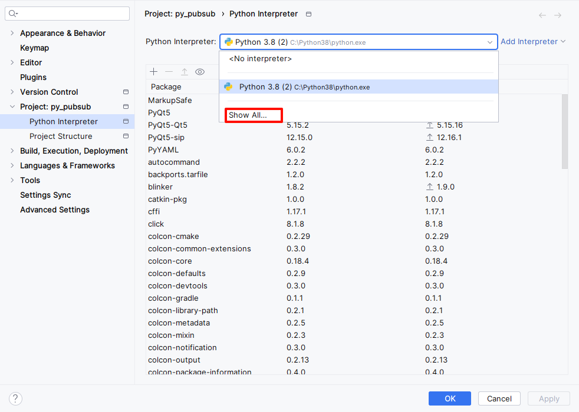
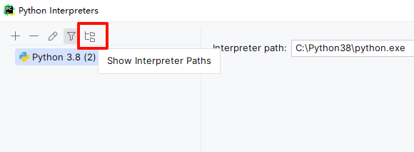
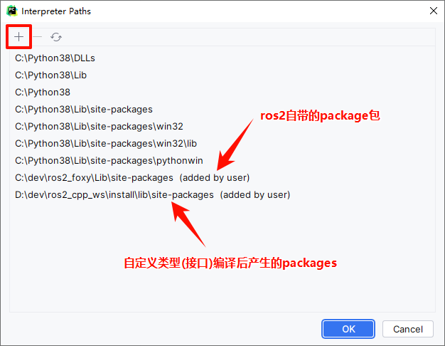
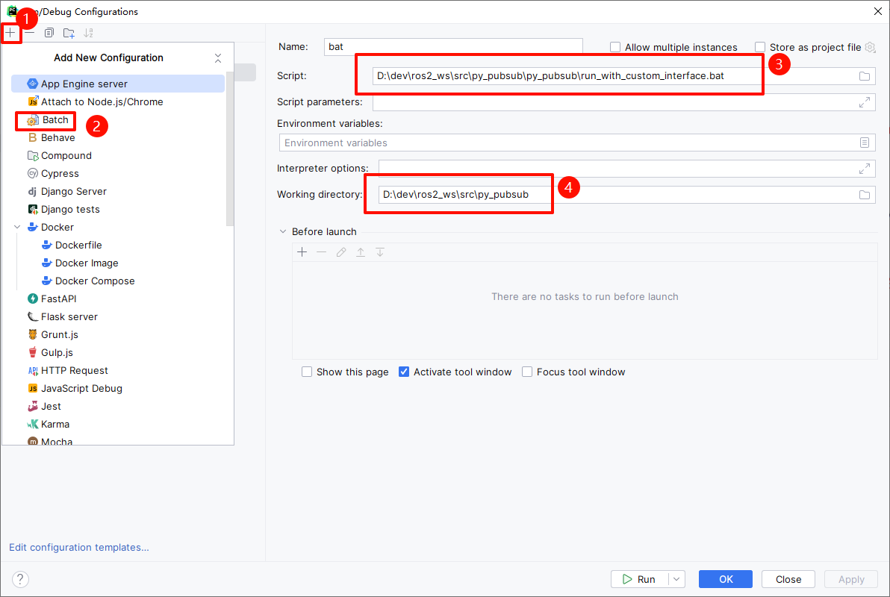

# 注意
***本项目是基于ros2工作目录下的一个package来进行配置，这意味这py_pubsub工程是一个ros2的package。***
# 环境配置

# 增加site-packages
1. 点击`show all`

2. 点击path图标

3. 增加自定义路径

# 关于模块的运行
## 未引入自定义类型的节点
对于未引入自定义类型的节点（如`py_pubsub/publisher_member_function.py`），可以在py文件内，右键-run运行。
## 引入了自定义类型的节点
引入了自定义类型的节点，比如`py_pubsub/publisher.py`,它引入了自定义的`my_package.msg`中的`CustomMessage`；
1. 首先确保c++项目中的my_package包已使用ros2编译，然后需要自定义一个`run_with_custom_interface.bat`运行文件，并相应修改路径后保存；
2. 下载插件`Batch Scripts Support`（pycharm没有bat类型的运行器），进行如下配置即可：

